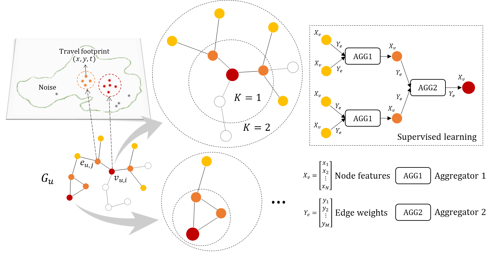

## Graph-based Representation for Identifying Individual Travel Activities with Spatiotemporal Trajectories and POI Data

This repository provides the implementation of the following paper:
> Graph-based Representation for Identifying Individual Travel Activities with Spatiotemporal Trajectories and POI Data <br>
> [Xinyi Liu](https://github.com/XinyiHolly) (Data Science, Zoox. Inc.), [Meiliu Wu](mwu233@wisc.edu) (Spatial Computing and Data Mining Lab, UW-Madison),<br>
> [Bo Peng](https://github.com/ibopeng) (Ping An Labs, PAII), and [Qunying Huang](qhuang46@wisc.edu)* (Spatial Computing and Data Mining Lab, UW-Madison) 
> <br>(* indicates corresponding author.)<br>

> **Abstract:** 
*Individual daily travel activities (e.g., work, eating) are identified with various machine learning models (e.g., Bayesian Network,
Random Forest) for understanding people’s frequent travel purposes. However, labor-intensive engineering work is often
required to extract effective features. Additionally, features and models are mostly calibrated for individual trajectories with
regular daily travel routines and patterns, and therefore suffer from poor generalizability when applied to new trajectories with
more irregular patterns. Meanwhile, most existing models cannot extract features to explicitly represent regular travel activity
sequences. Therefore, this paper proposes a graph-based representation of spatiotemporal trajectories and point-of-interest
(POI) data for travel activity type identification, defined as Gstp2Vec. Specifically, a weighted directed graph is constructed
by connecting regular activity areas (i.e., zones) detected via clustering individual daily travel trajectories as graph nodes,
with edges denoting trips between pairs of zones. Statistics of trajectories (e.g., visit frequency, activity duration) and POI
distributions (e.g., percentage of restaurants) at each activity zone are encoded as node features. Next, trip frequency, average
trip duration, and average trip distance are encoded as edge weights. Then a series of feedforward neural networks are
trained to generate low-dimensional embeddings for activity nodes through sampling and aggregating spatiotemporal and
POI features from their multihop neighborhoods. Activity type labels collected via travel surveys are used as ground truth for
backpropagation. The experiment results with real-world GPS trajectories show that Gstp2Vec significantly reduces feature
engineering efforts by automatically learning feature embeddings from raw trajectories with minimal prepossessing efforts. It
not only enhances model generalizability to receive higher identification accuracy on test individual trajectories with diverse
travel patterns, but also obtains better efficiency and robustness. In particular, our identification of the most common daily travel
activities (e.g., Dwelling and Work) for people with diverse travel patterns outperforms state-of-the-art classification models.*<br>

<p align="center">
  
</p>

## Implementation
### Installation
Clone this repository.
```
git clone https://github.com/XinyiHolly/Gstp2Vec-TravelActivityClassification.git
cd Gstp2Vec-TravelActivityClassification
pip install -r requirements.txt
```
### Datasets
We used two datasets in our paper:
1. [OSM landuse and POI datasets](http://download.geofabrik.de/north-america/us.html)
2. GPS trajectory data (available from the corresponding author on a reasonable request)

### How to Run
1. processing.py generates: 
   - activityzone.csv, which contains activity zones with their spatiotemporal and POI properties
   - graph.csv, which contains graph edges with their origin and destination nodes
2. Gstp2VecDemo.ipynb demostrates:
   - generation of input representations (i.e., t, s, p)
   - creation of graph-based representation model based on weighted bi-directional GraphSAGE
   - supervised learning:
     - build and run the representation learning model under a two-split setup (i.e., training-test split)
     - build and run the representation learning model under a three-split setup (i.e., training-validation-test split)
   - semi-supervised learning:
     - build and run the representation learning model under a three-split setup (i.e., training-validation-test split)
